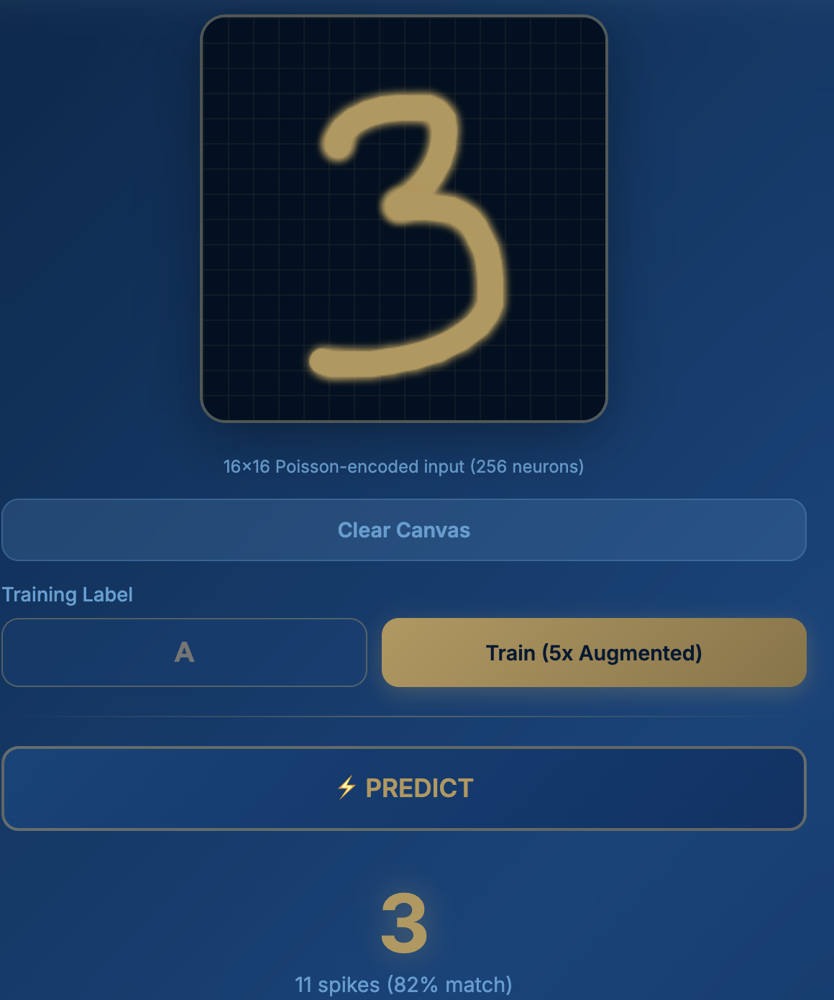
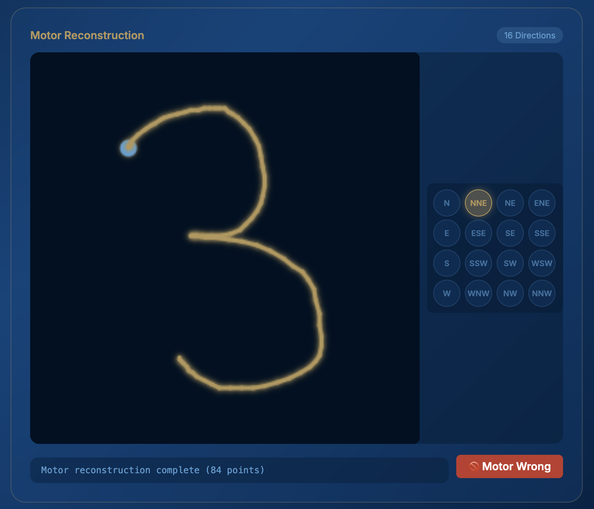
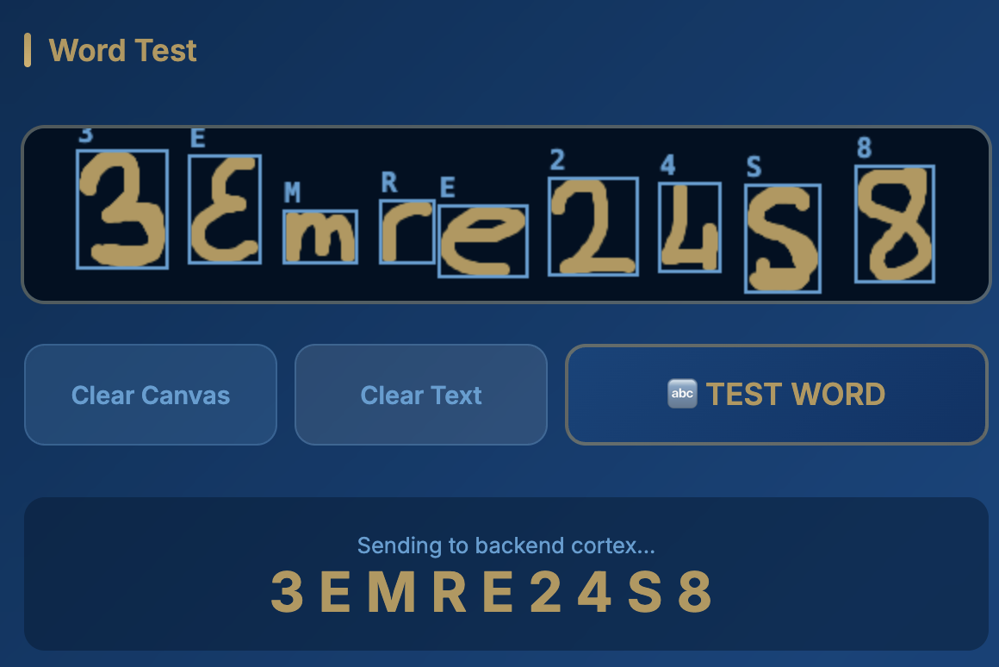

# Neuromorphic Computing Experiments

This repository contains a collection of exercises and projects exploring signal processing, artificial neural networks (ANN), and neuromorphic computing concepts using Spiking Neural Networks (SNN).

The projects demonstrate the transition from traditional signal processing methods to biologically inspired computing models.

---

## Project Structure

### 1. Homework 1: Waveform Classifier (FFT + ANN)
**Path:** `Homework1/waveform_classifier.py`

This project implements a classic machine learning approach to signal classification. It identifies fundamental waveforms (Sine, Square, Triangle) using frequency domain analysis.

*   **Key Techniques:**
    *   **Fast Fourier Transform (FFT):** Implements a recursive Radix-2 FFT algorithm to analyze signal frequency components.
    *   **Harmonic Analysis:** Extracts feature vectors based on the ratios of harmonic frequencies (2nd, 3rd, etc.) relative to the fundamental frequency.
    *   **Artificial Neural Network (ANN):** Uses a standard feed-forward neural network with backpropagation to classify the waveforms based on their harmonic signatures.
*   **Visualization:** Displays the generated waveform and classification confidence scores.

### 2. Homework 2: Spiking Neural Network Classifier (LIF)
**Path:** `Homework2/snn_classifier.py`

This project solves the same classification problem but adopts a neuromorphic approach, simulating biological neurons.

*   **Key Techniques:**
    *   **Leaky Integrate-and-Fire (LIF) Neurons:** Simulates neurons that accumulate membrane potential over time and "spike" when a threshold is reached.
    *   **Temporal Coding:** Information is processed over time steps, mimicking how real brains process signals.
    *   **Spike-Based Learning:** Weights are adjusted based on the spiking activity and error signal (using a delta-rule adaptation for SNNs).
*   **Visualization:**
    *   **Membrane Potential Traces:** Features a real-time oscilloscope-style visualization showing the voltage ($v$) of each neuron.
    *   **Dynamics:** Users can observe the voltage building up, hitting the threshold, firing a spike, and resetting, providing a clear view of the SNN dynamics.

---

### 3. Project: Neuromorphic OCR with Motor Cortex Simulation
**Path:** `Project/`

This is the main project that combines character recognition via SNN with a biologically-inspired motor cortex simulation. The system can learn handwritten characters, recognize them using exemplar-based K-NN, and then reconstruct the trajectory through motor cortex population vector coding.

#### Architecture Overview

```
┌─────────────────┐    ┌──────────────────┐    ┌─────────────────────┐
│   Input Layer   │───▶│   Visual Cortex  │───▶│   Motor Cortex      │
│   (16x16 Grid)  │    │   (SNN + K-NN)   │    │   (16 Dir. Neurons) │
└─────────────────┘    └──────────────────┘    └─────────────────────┘
        │                       │                        │
   Draw Canvas            Classify &              Regenerate
   (Stroke Points)        Recognize               Trajectory
```

#### Key Features

*   **Exemplar-Based Learning:**
    *   Stores up to 80 samples per class (smart pruning removes redundant samples)
    *   K-NN prediction finds the most similar exemplar across all classes
    *   Data augmentation with Gaussian blur for topology-based matching

*   **Motor Cortex Simulation (Georgopoulos Population Vector Coding):**
    *   16 directional LIF neurons (N, NNE, NE, ENE, E, ESE, SE, SSE, S, SSW, SW, WSW, W, WNW, NW, NNW)
    *   Stores raw trajectory points for each learned character
    *   Regenerates handwriting by replaying stored trajectories with motor neuron activation

*   **Word Recognition:**
    *   Segments word images into individual characters using vertical projection profiles
    *   Recognizes each character independently and combines predictions
    *   Supports training and testing multi-character sequences

#### Screenshots

**Character Prediction Interface:**


**Motor Cortex Trajectory Reconstruction:**


**Word Recognition Test:**


#### File Structure

| File | Description |
| :--- | :--- |
| `app.py` | Flask web application with REST endpoints |
| `snn_core.py` | OCRSNN class with LIF neurons and exemplar storage |
| `motor_cortex.py` | MotorCortex class with trajectory storage and population vector coding |
| `word_processor.py` | Character segmentation from word images |
| `templates/index.html` | Interactive web UI with drawing canvas |

#### Usage

```bash
cd Project
pip install -r requirements.txt
python app.py
```

Then open `http://127.0.0.1:5004` in your browser.

---

## Getting Started

### Prerequisites

Ensure you have the required Python packages installed:

```bash
pip install -r requirements.txt
```

### Running the Projects

Each project runs as a local web application using **Flask**.

**To run Homework 1 (ANN):**
```bash
cd Homework1
python waveform_classifier.py
```

**To run Homework 2 (SNN):**
```bash
cd Homework2
python snn_classifier.py
```

Once running, open your browser and navigate to `http://127.0.0.1:5000` (or the port specified in the console).

---

## Concepts Covered

| Concept | Homework 1 (ANN) | Homework 2 (SNN) |
| :--- | :--- | :--- |
| **Input Processing** | Static Feature Vector | Temporal Input Stream |
| **Neuron Model** | Sigmoid Activation | Leaky Integrate-and-Fire (LIF) |
| **Output** | Probability (0.0 - 1.0) | Spike Counts / Rate Coding |
| **Biorealism** | Low (Abstract Math) | High (Bio-simulation) |

